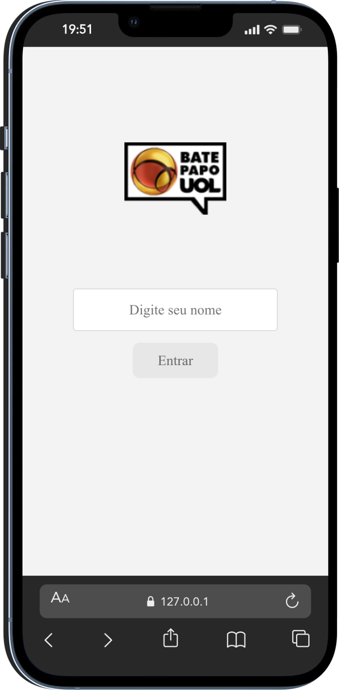
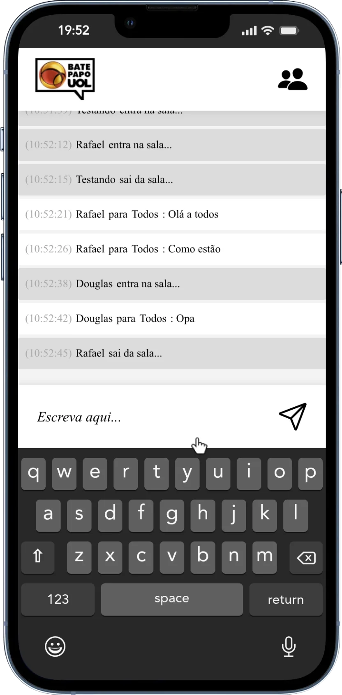

<h1>Bate-Papo UOL</h1>

Bate-Papo UOL é uma aplicação de mensagens em tempo real inspirada no clássico chat do portal UOL. Desenvolvido com HTML, CSS e JavaScript puro, o projeto consome uma API para gerenciar o login de participantes, manutenção de status online e o fluxo de mensagens públicas e privadas. A interface foi construída seguindo o conceito mobile-first para garantir uma experiência limpa e responsiva.

| 

 | 

 |
|:-:|:-:|

## 🔨 Features

- `Feature 1`: **Atualização em Tempo Real**: O chat busca novas mensagens automaticamente a cada 3 segundos, mantendo a conversa fluida sem a necessidade de recarregar a página manualmente.

- `Feature 2`: **Gestão de Presença**: Um sistema de "heartbeat" envia atualizações de status para o servidor a cada 5 segundos, garantindo que o usuário permaneça ativo na sala enquanto estiver conectado.

- `Feature 3`: **Filtro de Mensagens e Privacidade**: Suporte para mensagens públicas, notificações de status (entrada/saída) e mensagens reservadas, que são visíveis apenas para o destinatário e o remetente.

- `Feature 4`: **Interface Adaptativa & Scroll Inteligente**: Design focado em dispositivos móveis com menu lateral para participantes e um sistema de rolagem que acompanha as novas mensagens apenas quando o usuário está no final do chat.

## 🛠️ Open and run the project

- 📁 O projeto Bate-Papo UOL é open source e pode ser acessado pelo link: [https://github.com/Teones/projeto5-batepapo-uol](https://github.com/Teones/projeto5-batepapo-uol).
- ▶️ Para rodar o projeto diretamente no navegador, o deploy foi realizado em: [https://teones.github.io/projeto5-batepapo-uol/](https://teones.github.io/projeto5-batepapo-uol/).

## ✔️ Techniques and technologies used

